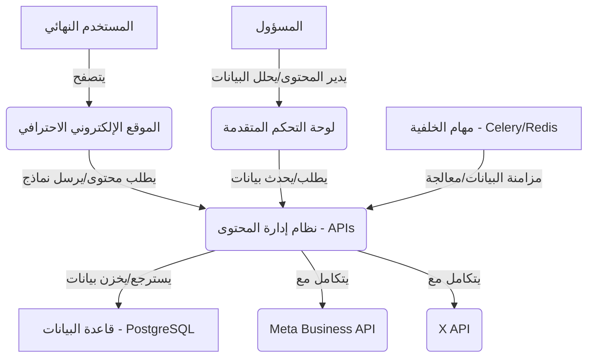

# مسودة النظام الشاملة وخطة التطوير

## 1. معلومات النظام الحالية

بناءً على سجل المحادثات والملفات التي تم إنشاؤها/تعديلها، يتكون النظام الحالي من المكونات الرئيسية التالية:

### أ. الموقع الإلكتروني الاحترافي (website_project_v3)

- **التقنيات**: HTML, CSS (بما في ذلك `glass-morphism.css`, `enhanced-gradients.css`, `dark-mode.css`, `style.css`), JavaScript (بما في ذلك `cms-integration.js`, `enhanced-interactions.js`, `lottie-animations.js`, `dark-mode-toggle.js`, `form-validation.js`).

- **الميزات**: تصميم متجاوب، قسم إحصائيات تفاعلي، نماذج لطلب الحلول (مثل `request-comprehensive.html`)، تفاعلات متقدمة ورسوم متحركة، تكامل مع CMS عبر APIs، نظام تتبع الزوار، تخزين مؤقت، تنسيقات CSS ديناميكية، تأثيرات Glass Morphism، تدرجات لونية محسنة، إعداد Lottie للرسوم المتحركة، وضع ليلي، breadcrumbs، قائمة تنقل ثابتة، تحقق فوري من النماذج، lazy loading للصور.

- **الملفات الرئيسية**: `index.html`, `request-comprehensive.html`.

### ب. لوحة التحكم المتقدمة (admin_panel)

- **التقنيات**: HTML, CSS, JavaScript (بما في ذلك `common.js`, `login.js`).

- **الميزات**: واجهة احترافية لإدارة الموقع، نظام إدارة المحتوى الديناميكي، تحليلات وتقارير شاملة، إدارة النماذج والرسائل، إدارة الصفحات، إدارة المدونة، مكتبة الوسائط، الإعدادات.

- **الملفات الرئيسية**: `pages-management.html`, `blog-management.html`, `forms-management.html`, `analytics.html`, `messages.html`, `media-library.html`, `settings.html`.

### ج. نظام إدارة المحتوى (CMS) - الواجهة الخلفية (idea_cms_project)

- **التقنيات**: Django, Python, Django REST Framework, PostgreSQL (مفترض).

- **الميزات**: نظام إدارة محتوى ديناميكي، تكامل مع Meta Business API و X (Twitter) API، نظام مزامنة البيانات التلقائية، تقارير حملات إعلانية مدمجة، APIs شاملة للتكاملات مع ViewSets، نظام تقارير موحدة، إدارة الحملات من لوحة التحكم.

- **الملفات الرئيسية**: `cms/integrations.py`, `cms/management/commands/sync_platforms.py`, `cms/views.py`, `cms/urls.py`, `cms/models.py`, `cms/admin.py`, `idea_cms/settings.py`, `requirements.txt`.

### د. التوثيق والملفات المساعدة

- `README.md`

- `INSTALLATION_GUIDE.md`

- `PROJECT_SUMMARY.md`

- `test_results.md`

- `system_issues_found.md`

- `COMPREHENSIVE_SYSTEM_EVALUATION_REPORT.md`

- `DETAILED_IMPROVEMENT_PLAN.md`

- `todo.md`

### هـ. المشاكل المعروفة

- **مشكلة لوحة التحكم**: تم تحديد مشكلة في نظام تسجيل الدخول للوحة التحكم تتطلب إصلاح الاتصال مع Django CMS.

هذه المعلومات ستكون أساسًا لمسودة النظام الشاملة وخطة التطوير.

## 2. هيكل النظام (System Architecture)

يعتمد نظام آيديا للاستشارات والحلول التسويقية على بنية معيارية (Modular Architecture) موزعة، مما يضمن المرونة، قابلية التوسع، وسهولة الصيانة. يتكون النظام من ثلاثة مكونات رئيسية تتفاعل فيما بينها لتقديم تجربة متكاملة للمستخدمين والمسؤولين:

### أ. الموقع الإلكتروني الاحترافي (Frontend Website)

يمثل الموقع الإلكتروني الواجهة الأمامية التي يتفاعل معها المستخدمون النهائيون. يعتمد على تقنيات الويب القياسية (HTML, CSS, JavaScript) ويتم تطويره كـ **تطبيق صفحة واحدة (Single Page Application - SPA)** أو **تطبيق متعدد الصفحات (Multi-Page Application - MPA)** مع تحميل ديناميكي للمحتوى. يتصل هذا المكون بالواجهة الخلفية (CMS) عبر واجهات برمجة التطبيقات (APIs) لجلب المحتوى، إرسال النماذج، وتتبع سلوك المستخدم.

**المكونات الفرعية:**

- **HTML Structure**: يوفر الهيكل الأساسي للصفحات.

- **CSS Styling**: يتضمن ملفات CSS لتصميم الواجهة، بما في ذلك التصميم المتجاوب، تأثيرات Glass Morphism، التدرجات اللونية، والوضع الليلي.

- **JavaScript Logic**: يدير التفاعلات الديناميكية، تكامل CMS، التحقق من النماذج، الرسوم المتحركة (Lottie)، وتتبع الزوار.

- **Assets**: يشمل الصور، الأيقونات، ملفات الفيديو، وملفات Lottie JSON.

### ب. لوحة التحكم المتقدمة (Admin Panel)

تعتبر لوحة التحكم واجهة الإدارة للمسؤولين، وتوفر أدوات شاملة لإدارة محتوى الموقع، مراقبة التحليلات، والتحكم في الإعدادات. تم تصميمها كواجهة ويب منفصلة تتصل أيضاً بالواجهة الخلفية (CMS) عبر APIs. على الرغم من أنها مبنية حالياً بتقنيات الويب التقليدية (HTML, CSS, JavaScript)، إلا أن هناك خطة لتحديثها باستخدام إطار عمل JavaScript حديث لتعزيز التفاعلية وتجربة المستخدم.

**المكونات الفرعية:**

- **HTML Pages**: صفحات منفصلة لكل قسم إداري (إدارة الصفحات، المدونة، النماذج، التحليلات، الرسائل، مكتبة الوسائط، الإعدادات).

- **CSS Styling**: لتصميم واجهة لوحة التحكم.

- **JavaScript Logic**: يدير منطق الواجهة الأمامية، التفاعلات، وعمليات تسجيل الدخول والإدارة.

### ج. نظام إدارة المحتوى (CMS) - الواجهة الخلفية (Backend)

يمثل هذا المكون القلب النابض للنظام، حيث يدير جميع البيانات، المنطق التجاري، والتكاملات الخارجية. تم تطويره باستخدام إطار عمل Django القوي والموثوق به، مع استخدام Django REST Framework لتوفير واجهات برمجة تطبيقات RESTful للموقع ولوحة التحكم.

**المكونات الفرعية:**

- **Django Core**: يدير نماذج البيانات (Models)، طرق العرض (Views)، وعناوين URL (URLs).

- **Database (PostgreSQL)**: قاعدة البيانات الرئيسية لتخزين جميع بيانات المحتوى، المستخدمين، النماذج، التحليلات، وإعدادات التكامل.

- **Django REST Framework**: يوفر APIs آمنة وقابلة للتوسع للموقع ولوحة التحكم.

- **External Integrations**: وحدات مخصصة للتكامل مع Meta Business API و X (Twitter) API لإدارة الحملات الإعلانية وجلب التقارير.

- **Background Tasks (Celery/Redis)**: لمعالجة المهام الثقيلة أو المجدولة مثل مزامنة البيانات مع المنصات الخارجية.

- **Authentication & Authorization**: نظام إدارة المستخدمين والصلاحيات.

- **Caching (Redis)**: لتحسين أداء APIs وتقليل حمل قاعدة البيانات.

### د. تدفق البيانات والتفاعل (Data Flow and Interaction)

يتفاعل الموقع ولوحة التحكم مع نظام إدارة المحتوى (CMS) عبر APIs. على سبيل المثال:

- عندما يطلب المستخدم صفحة من الموقع، يقوم JavaScript في الواجهة الأمامية بإجراء طلب API إلى CMS لجلب محتوى الصفحة ديناميكياً.

- عندما يقوم مسؤول بتحديث مقال في لوحة التحكم، يتم إرسال طلب API إلى CMS لتحديث البيانات في قاعدة البيانات.

- تقوم مهام الخلفية في CMS بمزامنة البيانات مع Meta Business و X APIs بشكل دوري.

تضمن هذه البنية الفصل الواضح بين الواجهات الأمامية والخلفية، مما يتيح تطوير كل مكون بشكل مستقل ويسهل عملية التوسع والصيانة في المستقبل.



```

```

## 3. خطة التطوير والمهام

تعتمد خطة التطوير على منهجية تكرارية (Iterative Methodology) لضمان التسليم المستمر للقيمة ومعالجة المشاكل الحرجة أولاً. سيتم تقسيم عملية التطوير إلى مراحل رئيسية، مع تحديد المهام التفصيلية لكل مرحلة.

### أ. المرحلة 0: إصلاح بيئة Sandbox (مهمة حرجة)

**الهدف**: استعادة بيئة التطوير للعمل بشكل كامل وتمكين تنفيذ الأوامر البرمجية.

**المهام**:

- التواصل مع فريق الدعم الفني لحل مشكلة `Segmentation fault` و `Input/output error`.

- التحقق من استقرار البيئة بعد الإصلاح.

**ملاحظة**: هذه المرحلة خارج نطاق التحكم المباشر للتطوير ولكنها ضرورية للبدء.

### ب. المرحلة 1: تحسينات الواجهة الأمامية للموقع الرئيسي (بصريات وتجربة مستخدم)

**الهدف**: تعزيز الجاذبية البصرية وتجربة المستخدم للموقع الرئيسي.

**المهام**:

- **تطبيق تأثيرات Glass Morphism**: على البطاقات والعناصر التفاعلية (تم البدء بها).

- **تحسين الرسوم المتحركة**: إضافة تأثيرات Lottie للأيقونات والعناصر التفاعلية (يتطلب ملفات JSON).

- **تطبيق التدرجات اللونية المحسنة**: استخدام تدرجات متطورة مع الألوان الزيتي والبيج.

- **إضافة الوضع الليلي**: توفير خيار للتبديل بين الوضع النهاري والليلي.

- **تحسين التنقل**: إضافة breadcrumbs وقائمة تنقل ثابتة.

- **تحسين النماذج**: إضافة تحقق فوري من البيانات مع رسائل توضيحية.

- **تحسين سرعة التحميل**: تحسين الصور وتطبيق lazy loading.

- **إضافة Chatbot**: كمساعد ذكي للإجابة على الاستفسارات الأساسية عن آيديا.

### ج. المرحلة 2: إصلاح وتحسين نظام لوحة التحكم (تسجيل الدخول، الأمان، الواجهة)

**الهدف**: إصلاح المشاكل الحرجة في لوحة التحكم وتعزيز وظائفها وأمانها وتجربة المستخدم.

**المهام**:

- **إصلاح نظام تسجيل الدخول**: حل مشكلة الاتصال مع Django CMS.

- **تحسين معالجة الأخطاء**: إضافة رسائل خطأ واضحة ومفيدة.

- **تحسين الأمان**: تطبيق أفضل الممارسات للمصادقة والتفويض.

- **تحديث الواجهة الأمامية**: باستخدام إطار عمل JavaScript حديث (مثل React أو Vue.js) لتعزيز التفاعلية.

- **إضافة لوحة قيادة تفاعلية**: برسوم بيانية حية وإحصائيات في الوقت الفعلي.

- **تحسين التنقل**: قائمة جانبية قابلة للطي مع أيقونات واضحة.

- **تحسين الجداول**: إضافة فلترة وترتيب متقدم للبيانات.

- **إضافة نظام إشعارات**: في الوقت الفعلي للأحداث المهمة.

### د. المرحلة 3: الميزات المتقدمة وتحسينات الأداء

**الهدف**: إضافة وظائف متقدمة وتحسين الأداء العام للنظام.

**المهام**:

- **تحسين محركات البحث (SEO)**: مع meta tags ديناميكية.

- **تحليلات متقدمة**: لتتبع سلوك المستخدم وتحليل الأداء.

- **تكامل مع منصات التواصل**: لمشاركة سهلة للمحتوى.

- **تحسينات الأداء على المدى الطويل**: مراقبة الأداء المتقدمة، تحسينات قاعدة البيانات، التفكير في البنية التحتية السحابية.

### هـ. المرحلة 4: تحسينات الاستجابة والتوافق

**الهدف**: ضمان تجربة مستخدم سلسة ومتناسقة عبر جميع الأجهزة والمتصفحات.

**المهام**:

- **تحسين التصميم للجوال**: لجميع صفحات الموقع ولوحة التحكم.

- **تحسين القوائم المنسدلة**: للشاشات الصغيرة.

- **تحسين تخطيط النماذج**: على الأجهزة المحمولة.

- **اختبار التوافق عبر المتصفحات**: لضمان عرض متناسق.

### و. المرحلة 5: التوثيق والتوحيد

**الهدف**: توفير توثيق شامل للنظام وتوحيد العناصر البصرية والتقنية.

**المهام**:

- **إنشاء دليل شامل للمطورين الجدد**.

- **تحسين التعليقات البرمجية**: لجميع أجزاء الكود المهمة.

- **توثيق API**: باستخدام أدوات مثل Django REST Swagger أو drf-yasg.

- **استيراد محتوى الموقع إلى نظام إدارة المحتوى**: لضمان إدارة مركزية.

- **توحيد الشريط للأقسام الرئيسية**: في جميع صفحات الموقع.

- **إضافة الأيقونة الرئيسية**: للموقع ولوحة التحكم ونظام إدارة المحتوى.

- **استخدام الألوان الزيتي والبيج**: في لوحة التحكم ونظام إدارة المحتوى لتوحيد الهوية البصرية.

### ز. المرحلة 6: الاختبار الشامل والتسليم

**الهدف**: التأكد من جودة النظام واستقراره قبل التسليم النهائي.

**المهام**:

- **اختبار وظيفي شامل**: لجميع الميزات والوظائف.

- **اختبار الأداء والتحمل**: لضمان قدرة النظام على التعامل مع الأحمال العالية.

- **اختبار الأمان**: للتحقق من الثغرات الأمنية.

- **اختبار تجربة المستخدم (UAT)**: مع المستخدمين النهائيين.

- **تحضير ملفات التسليم النهائية**: بما في ذلك الكود، قواعد البيانات، والتوثيق.

هذه الخطة توفر خارطة طريق واضحة للتطوير، مع إمكانية التكيف بناءً على النتائج والتحديات التي قد تظهر خلال التنفيذ.

## 4. التقنيات والأدوات المستخدمة

يعتمد تطوير نظام آيديا للاستشارات والحلول التسويقية على مجموعة من التقنيات والأدوات الحديثة والموثوقة، والتي تم اختيارها بناءً على معايير الأداء، قابلية التوسع، سهولة الصيانة، والدعم المجتمعي. تضمن هذه التقنيات بناء نظام قوي ومرن يلبي الاحتياجات الحالية والمستقبلية.

### أ. الواجهة الخلفية (Backend) - نظام إدارة المحتوى (CMS)

- **لغة البرمجة**: **Python 3.x** [1]
  - تم اختيار Python لسهولتها، مرونتها، ومكتباتها الغنية التي تدعم تطوير الويب، معالجة البيانات، والذكاء الاصطناعي.

- **إطار العمل (Web Framework)**: **Django 4.x** [2]
  - Django هو إطار عمل ويب عالي المستوى وسريع التطوير، يتبع مبدأ "البطاريات متضمنة" (Batteries Included)، مما يوفر حلولاً جاهزة للعديد من المهام الشائعة مثل إدارة قواعد البيانات، المصادقة، ولوحة الإدارة.

- **واجهة برمجة التطبيقات (API Framework)**: **Django REST Framework (DRF)** [3]
  - DRF هو إضافة قوية لـ Django تسهل بناء واجهات برمجة تطبيقات RESTful، مما يتيح التواصل الفعال والآمن بين الواجهة الخلفية والواجهات الأمامية المختلفة.

- **قاعدة البيانات**: **PostgreSQL** [4]
  - PostgreSQL هي قاعدة بيانات علائقية مفتوحة المصدر، معروفة بموثوقيتها، أدائها، وميزاتها المتقدمة التي تدعم أنواع بيانات معقدة وتوفر قابلية توسع عالية.

- **نظام قائمة الانتظار (Message Broker)**: **Redis** [5]
  - يستخدم Redis كـ message broker لـ Celery، وكمخزن بيانات في الذاكرة (in-memory data store) للتخزين المؤقت (caching)، مما يحسن سرعة استجابة النظام ويقلل الحمل على قاعدة البيانات.

- **معالجة المهام غير المتزامنة (Asynchronous Task Queue)**: **Celery** [6]
  - Celery هو نظام مهام موزع يستخدم لمعالجة المهام الطويلة الأمد أو المجدولة في الخلفية، مثل مزامنة البيانات مع APIs الخارجية، إرسال رسائل البريد الإلكتروني، أو إنشاء التقارير.

- **خادم الويب (Web Server)**: **Gunicorn** (للتشغيل في الإنتاج) [7]
  - Gunicorn هو خادم WSGI (Web Server Gateway Interface) لـ Python، يستخدم لتشغيل تطبيقات Django في بيئات الإنتاج بكفاءة.

- **خادم وكيل عكسي (Reverse Proxy)**: **Nginx** (للتشغيل في الإنتاج) [8]
  - Nginx هو خادم ويب عالي الأداء ووكيل عكسي، يستخدم لتوجيه طلبات HTTP إلى Gunicorn، وخدمة الملفات الثابتة، وتوفير ميزات مثل SSL/TLS وموازنة التحميل.

### ب. الواجهة الأمامية (Frontend) - الموقع الإلكتروني ولوحة التحكم

- **لغات الويب الأساسية**: **HTML5, CSS3, JavaScript (ES6+)** [9]
  - تشكل هذه اللغات العمود الفقري لأي تطبيق ويب حديث، وتوفر المرونة اللازمة لبناء واجهات مستخدم غنية وتفاعلية.

- **مكتبات JavaScript**:
  - **jQuery**: لتسهيل التلاعب بـ DOM ومعالجة الأحداث (مستخدم حالياً، مع التوجه لتقليل الاعتماد عليه).
  - **Lottie-web**: لتشغيل الرسوم المتحركة المتجهة (Vector Animations) عالية الجودة التي تم إنشاؤها باستخدام After Effects وتصديرها كملفات JSON [10].
  - **Chart.js / D3.js**: لإنشاء رسوم بيانية تفاعلية وعرض البيانات في لوحة التحكم.

- **أطر عمل CSS**:
  - **Bootstrap / Tailwind CSS**: (مقترح لتحديث لوحة التحكم) لتسريع عملية تصميم الواجهة الأمامية وتوفير مكونات جاهزة ومتجاوبة.

- **إطار عمل JavaScript (مقترح لتحديث لوحة التحكم)**: **React.js / Vue.js** [11]
  - استخدام إطار عمل حديث مثل React أو Vue.js سيعزز بشكل كبير من تفاعلية لوحة التحكم، قابلية صيانتها، وأدائها، مما يوفر تجربة مستخدم أفضل.

### ج. أدوات التطوير والتحسين

- **نظام التحكم في الإصدارات (Version Control System)**: **Git** [12]
  - يستخدم Git لإدارة الكود المصدري، تتبع التغييرات، والتعاون بين المطورين.

- **بيئة التطوير المتكاملة (IDE)**: **VS Code / PyCharm** (مقترح للمطورين)
  - توفر بيئات تطوير غنية بالميزات لدعم عملية البرمجة، التصحيح، وإدارة المشاريع.

- **أدوات تحسين الأداء**:
  - **Google Lighthouse**: لتحليل أداء الويب وتحسينه.
  - **WebPageTest**: لاختبار سرعة تحميل الصفحات.

- **أدوات توثيق API**: **Django REST Swagger / drf-yasg** [13]
  - لتوليد توثيق تفاعلي لواجهات برمجة التطبيقات، مما يسهل على المطورين فهم واستخدام APIs.

تضمن هذه المجموعة المتنوعة من التقنيات والأدوات بناء نظام قوي، حديث، وقابل للتوسع، قادر على تلبية متطلبات آيديا للاستشارات والحلول التسويقية بفعالية.

**المراجع:**
[1] Python: [https://www.python.org/](https://www.python.org/)
[2] Django: [https://www.djangoproject.com/](https://www.djangoproject.com/)
[3] Django REST Framework: [https://www.django-rest-framework.org/](https://www.django-rest-framework.org/)
[4] PostgreSQL: [https://www.postgresql.org/](https://www.postgresql.org/)
[5] Redis: [https://redis.io/](https://redis.io/)
[6] Celery: [https://docs.celeryq.dev/en/stable/](https://docs.celeryq.dev/en/stable/)
[7] Gunicorn: [https://gunicorn.org/](https://gunicorn.org/)
[8] Nginx: [https://www.nginx.com/](https://www.nginx.com/)
[9] MDN Web Docs: [https://developer.mozilla.org/en-US/docs/Web](https://developer.mozilla.org/en-US/docs/Web)
[10] LottieFiles: [https://lottiefiles.com/](https://lottiefiles.com/)
[11] React: [https://react.dev/](https://react.dev/) | Vue.js: [https://vuejs.org/](https://vuejs.org/)
[12] Git: [https://git-scm.com/](https://git-scm.com/)
[13] Django REST Swagger: [https://github.com/marcgibbons/django-rest-swagger](https://github.com/marcgibbons/django-rest-swagger) | drf-yasg: [https://github.com/axnsan12/drf-yasg](https://github.com/axnsan12/drf-yasg)

## 5. المخرجات الرئيسية والمعالم (Key Deliverables and Milestones)

لضمان تتبع التقدم وقياس النجاح، سيتم تحديد مجموعة من المخرجات الرئيسية والمعالم لكل مرحلة من مراحل خطة التطوير. هذه المخرجات تمثل نقاط تفتيش مهمة وتساعد في الحفاظ على المشروع في المسار الصحيح.

### أ. المخرجات الرئيسية (Key Deliverables)

تمثل المخرجات الرئيسية النتائج الملموسة التي سيتم إنتاجها في نهاية كل مرحلة أو مهمة رئيسية. تشمل هذه المخرجات:

- **تقرير إصلاح بيئة Sandbox**: يوضح تفاصيل المشكلة والحلول المطبقة، ويؤكد استقرار البيئة.

- **الموقع الإلكتروني الاحترافي المحدث**: يشمل جميع التحسينات البصرية وتجربة المستخدم المطبقة، مع كود نظيف وموثق.

- **لوحة التحكم المحدثة والوظيفية**: مع إصلاح مشكلة تسجيل الدخول، وتحسينات الأمان، وواجهة مستخدم محسنة.

- **وحدات الميزات المتقدمة**: مثل تحسينات SEO، التحليلات المتقدمة، وتكاملات وسائل التواصل الاجتماعي.

- **تصميم متجاوب بالكامل**: يضمن عرضاً مثالياً على جميع أحجام الشاشات والأجهزة.

- **توثيق شامل للنظام**: يشمل دليل المطورين، توثيق API، وتعليقات برمجية محسنة.

- **تقرير اختبار شامل**: يوضح نتائج الاختبارات الوظيفية، الأداء، الأمان، وتجربة المستخدم.

- **حزمة تسليم نهائية**: تتضمن جميع ملفات الكود، قاعدة البيانات، والتوثيق اللازم للنشر.

### ب. المعالم (Milestones)

المعالم هي نقاط زمنية محددة في المشروع تشير إلى إنجاز مجموعة من المهام أو اكتمال مرحلة. تساعد المعالم في تتبع الجدول الزمني للمشروع وتوفير رؤية واضحة للتقدم.

| المعلم (Milestone) | المرحلة المرتبطة | الوصف | التاريخ التقديري (بعد إصلاح Sandbox) |
| --- | --- | --- | --- |
| **Sandbox جاهز للعمل** | 0: إصلاح Sandbox | تأكيد إصلاح بيئة Sandbox والقدرة على تنفيذ الأوامر البرمجية. | اليوم 1 |
| **الموقع الرئيسي - تحسينات بصرية مكتملة** | 1: تحسينات الواجهة الأمامية | تطبيق Glass Morphism، Lottie، التدرجات، والوضع الليلي. | اليوم 7 |
| **الموقع الرئيسي - تحسينات UX مكتملة** | 1: تحسينات الواجهة الأمامية | تطبيق تحسينات التنقل، النماذج، سرعة التحميل، وإعداد Chatbot. | اليوم 14 |
| **لوحة التحكم - إصلاحات حرجة مكتملة** | 2: إصلاح وتحسين لوحة التحكم | إصلاح تسجيل الدخول، تحسين معالجة الأخطاء، وتحسين الأمان. | اليوم 21 |
| **لوحة التحكم - واجهة محسنة** | 2: إصلاح وتحسين لوحة التحكم | تحديث الواجهة الأمامية، لوحة قيادة تفاعلية، تحسين الجداول والإشعارات. | اليوم 35 |
| **الميزات المتقدمة جاهزة** | 3: الميزات المتقدمة | تطبيق تحسينات SEO، التحليلات المتقدمة، وتكاملات التواصل الاجتماعي. | اليوم 49 |
| **النظام متجاوب بالكامل** | 4: تحسينات الاستجابة | ضمان التوافق والعرض الأمثل على جميع الأجهزة والمتصفحات. | اليوم 56 |
| **التوثيق والتوحيد مكتمل** | 5: التوثيق والتوحيد | إعداد دليل المطورين، توثيق API، توحيد الهوية البصرية، استيراد المحتوى. | اليوم 70 |
| **اختبار شامل مكتمل** | 6: الاختبار والتسليم | الانتهاء من جميع أنواع الاختبارات (وظيفي، أداء، أمان، UAT). | اليوم 77 |
| **تسليم المشروع النهائي** | 6: الاختبار والتسليم | تسليم جميع المخرجات النهائية وحزمة النشر. | اليوم 84 |

*ملاحظة: التواريخ التقديرية هي إرشادية وقد تتغير بناءً على تعقيد المهام الفعلية وأي تحديات غير متوقعة قد تظهر أثناء التطوير. يتم احتساب الأيام بعد إصلاح بيئة Sandbox.*

## 6. المخاطر المحتملة واستراتيجيات التخفيف (Potential Risks and Mitigation Strategies)

تحديد المخاطر المحتملة بشكل استباقي ووضع استراتيجيات للتخفيف منها هو جزء أساسي من إدارة المشاريع الناجحة. يساعد هذا النهج في تقليل التأثيرات السلبية على الجدول الزمني، الميزانية، وجودة المشروع. فيما يلي تحليل للمخاطر المحتملة لمشروع آيديا للاستشارات والحلول التسويقية واستراتيجيات التخفيف المقترحة.

| فئة المخاطر | المخاطر المحتملة                                                                                                                                                                                                                                                                                                                                                                                                                                                                                                                                                                                                                                                                                                                                                                                                                                                                                                                                                                                                                                                                                                                                                                                                                                                                                                                                                                                                                                                                                                                                                                                                                                                                                                                                                                                                                                                                                                                                                                                                                                                                                                                                                                                                                                                                                                                                                                                                                                                                                                                                                                                                                                                                                                                                                                                                                                                                                                                                                                                                                                                                                                                                                                                                                                                                                                                                                                                                                                                                                                                                                                                                                                                                                                                                                                                                                                                                                                                                                                                                                                                                                                                                                                                                                                                                                                                                                                                                                                                                                                                                                                                                                                                                                                                                                                                                                                                                                                                                                                                                                                                                                                                                                                                                                                                                                                                                                                                                                                                                                                                                                                                                                                                                                                                                                                                                                                                                                                                                                                                                                                                                                                                                                                                                                                                                                                                                                                                                                                                                                                                                                                                                                                                                                                                                                                                                                                                                                                                                                                                                                                                                                                                                                                                                                                                                                                                                                                                                                                                                                                                                                                                                                                                                                                                                                                                                                                                                                                                                                                                                                                                                                                                                                                                                                                                                                                                                                                                                                                                                                                                                                                                                                                                                                                                                                                                                                                                                                                                                                                                                                                                                                                                                                                                                                                                                                                                                                                                                                                                                                                                                                                                                                                                                                                                                                                                                                                                                                                                                                                                                                                                                                                                                                                                                                                                                                                                                                                                                                                                                                                                                                                                                                                                                                                                                                                                                                                                                                                                                                                                                                                                                                                                                                                                                                                                                                                                                                                                                                                                                                                                                                                                                                                                                                                                                                                                                                                                                                                                                                                                                                                                                                                                                                                                                                                                                                                                                                                                                                                                                                                                                                                                                                                                                                                                                                                                                                                                                                                                                                                                                                                                                                                                                                                                                                                                                                                                                                                                                                                                                                                                                                                                                                                                                                                                                                                                                                                                                                                                                                                                                                                                                                                                                                                                                                                                                                                                                                                                                                                                                                                                                                                                                                                                                                                                                                                                                                                                                                                                                                                                                                                                                                                                                                                                                                                                                                                                                                                                                                                                                                                                                                                                                                                                                                                                                                                                                                                                                                                                                                                                                                                                                                                                                                                                                                                                                                                                                                                                                                                                                                                                                                                                                                                                                                                                                                                                                                                                                                                                                                                                                                                                                                                                                                                                                                                                                                                                                                                                                                                                                                                                                 -

| فئة المخاطر | المخاطر المحتملة | استراتيجيات التخفيف |
| --- | --- | --- |
| **المخاطر التقنية** | **1. استمرار مشاكل بيئة Sandbox:** قد تستمر المشاكل الفنية في بيئة Sandbox، مما يؤدي إلى تأخيرات كبيرة في المشروع. | **- التواصل المستمر والمكثف مع فريق الدعم الفني.**<br>- **استكشاف بيئات تطوير بديلة (إذا أمكن).**<br>- **التركيز على المهام التي لا تتطلب Sandbox في هذه الأثناء (مثل إعداد المحتوى، جمع الأصول).** |
|  | **2. صعوبات في تحديث لوحة التحكم:** قد يكون تحديث الواجهة الأمامية للوحة التحكم باستخدام React/Vue.js أكثر تعقيدًا من المتوقع، خاصة فيما يتعلق بالتكامل مع الواجهة الخلفية الحالية. | **- إجراء دراسة جدوى أولية (Proof of Concept) لتقييم مدى تعقيد التكامل.**<br>- **البدء بمكونات صغيرة وتدريجية بدلاً من إعادة كتابة كاملة دفعة واحدة.**<br>- **توفير تدريب للمطورين على إطار العمل الجديد إذا لزم الأمر.** |
|  | **3. مشاكل أداء غير متوقعة:** قد يواجه النظام مشاكل أداء تحت الحمل العالي، حتى مع وجود التخزين المؤقت والمهام غير المتزامنة. | **- إجراء اختبارات أداء وتحمل بشكل دوري.**<br>- **استخدام أدوات مراقبة الأداء (APM) لتحديد الاختناقات.**<br>- **تحسين استعلامات قاعدة البيانات بشكل مستمر.** |
|  | **4. ثغرات أمنية:** قد يتم اكتشاف ثغرات أمنية جديدة في النظام أو في المكتبات المستخدمة. | **- إجراء مراجعات أمنية منتظمة للكود.**<br>- **تحديث المكتبات والتبعيات بشكل دوري.**<br>- **اتباع أفضل الممارسات الأمنية (OWASP Top 10).** |
| **مخاطر إدارة المشروع** | **1. زحف النطاق (Scope Creep):** قد تظهر طلبات لميزات جديدة أو تغييرات غير مخطط لها أثناء عملية التطوير. | **- تحديد نطاق المشروع بوضوح في البداية.**<br>- **تطبيق عملية إدارة تغيير رسمية لتقييم أي طلبات جديدة وتأثيرها على الجدول الزمني والميزانية.**<br>- **التواصل الواضح مع أصحاب المصلحة حول أولويات المشروع.** |
|  | **2. تقديرات زمنية غير دقيقة:** قد تكون التقديرات الزمنية للمهام متفائلة جدًا، مما يؤدي إلى تأخيرات في التسليم. | **- تقسيم المهام الكبيرة إلى مهام أصغر وأكثر قابلية للتقدير.**<br>- **إضافة وقت احتياطي (buffer) في الجدول الزمني للتعامل مع المشاكل غير المتوقعة.**<br>- **مراجعة التقديرات وتحديثها بانتظام بناءً على التقدم الفعلي.** |
|  | **3. نقص الموارد:** قد يكون هناك نقص في الموارد البشرية (المطورين) أو الموارد التقنية (الخوادم، التراخيص). | **- تخطيط الموارد بعناية في بداية المشروع.**<br>- **تحديد الموارد الحرجة وتأمينها مسبقًا.**<br>- **توفير خطط بديلة في حالة عدم توفر الموارد.** |
| **المخاطر الخارجية** | **1. تغييرات في APIs الخارجية:** قد تقوم Meta أو X بتغيير واجهات برمجة التطبيقات الخاصة بها، مما يؤثر على تكاملات النظام. | **- متابعة وثائق APIs الخارجية بشكل مستمر.**<br>- **تصميم وحدات التكامل لتكون مرنة وقابلة للتكيف.**<br>- **توفير معالجة أخطاء قوية للتعامل مع التغييرات غير المتوقعة في APIs.** |
|  | **2. عدم توفر الأصول المطلوبة:** قد يتأخر توفير الأصول المطلوبة مثل ملفات Lottie JSON أو المحتوى النهائي. | **- تحديد جميع الأصول المطلوبة في وقت مبكر من المشروع.**<br>- **التواصل الواضح مع الجهات المسؤولة عن توفير الأصول وتحديد مواعيد نهائية.**<br>- **استخدام أصول مؤقتة (placeholders) لتجنب توقف عملية التطوير.** |

من خلال تحديد هذه المخاطر ووضع استراتيجيات واضحة للتخفيف منها، يمكن زيادة فرص نجاح المشروع وتسليمه في الوقت المحدد وبجودة عالية.

## 7. مراجعة وتحسين المسودة

تم إعداد هذه المسودة لتكون شاملة ومفصلة قدر الإمكان، مع تغطية الجوانب الرئيسية للنظام وخطة التطوير. تهدف هذه المراجعة إلى التأكد من دقة المعلومات، وضوح الصياغة، واكتمال المحتوى.

### أ. نقاط القوة في المسودة:

- **الشمولية**: تغطي المسودة جميع الجوانب الأساسية للنظام، من هيكله وتقنياته إلى خطة التطوير والمخاطر المحتملة.

- **التفصيل**: تم تقديم تفاصيل كافية لكل قسم، مما يوفر فهماً واضحاً للمكونات والعمليات.

- **الوضوح**: الصياغة واضحة ومباشرة، مما يسهل قراءة وفهم المحتوى.

- **التنظيم**: تم تنظيم المسودة بشكل منطقي باستخدام عناوين وأقسام فرعية، مما يسهل التنقل بين الأجزاء المختلفة.

- **تحديد المخاطر**: تم تحديد المخاطر المحتملة بشكل استباقي وتقديم استراتيجيات للتخفيف منها، مما يعكس تخطيطاً جيداً للمشروع.

- **المعالم والمخرجات**: تحديد المخرجات الرئيسية والمعالم يساعد في تتبع التقدم وقياس النجاح.

### ب. مجالات التحسين المقترحة:

على الرغم من شمولية المسودة، يمكن اقتراح بعض التحسينات الطفيفة لزيادة فعاليتها:

- **تحديد الأولويات داخل المراحل**: يمكن إضافة مستوى من الأولويات (مثل: حرجة، عالية، متوسطة) للمهام داخل كل مرحلة من مراحل خطة التطوير، لضمان التركيز على المهام الأكثر أهمية أولاً.

- **تضمين أدوات إدارة المشروع**: يمكن الإشارة بشكل صريح إلى استخدام أداة لإدارة المشروع (مثل Trello أو Jira) لتتبع المهام وتعيينها ومراقبة التقدم بشكل أكثر فعالية.

- **مراجعة الأمان بشكل دوري**: إضافة نقطة في خطة الصيانة المستقبلية (يمكن إضافتها كملحق أو ضمن قسم المخاطر) لمراجعة الأمان بشكل دوري (مثلاً كل 3-6 أشهر) لضمان بقاء النظام محصنًا ضد التهديدات الجديدة.

- **التأكيد على اختبار الوحدة والتكامل**: في مرحلة الاختبار (المرحلة 6)، يمكن التأكيد بشكل أكبر على أهمية اختبارات الوحدة (Unit Tests) واختبارات التكامل (Integration Tests) بالإضافة إلى الاختبارات الوظيفية.

- **إضافة قسم للمصطلحات (Glossary)**: لتعريف أي مصطلحات تقنية أو خاصة بالمشروع قد لا تكون واضحة لجميع القراء.

- **إضافة ملحق للملحقات (Appendices)**: يمكن استخدام هذا القسم لإضافة تفاصيل إضافية مثل متطلبات الأجهزة، أو تفاصيل تكوين الخادم، أو أي رسوم بيانية معقدة.

بشكل عام، تعتبر المسودة وثيقة قوية وشاملة، والاقتراحات المذكورة أعلاه هي لتحسينات طفيفة تزيد من قيمتها كمرجع للمشروع.

